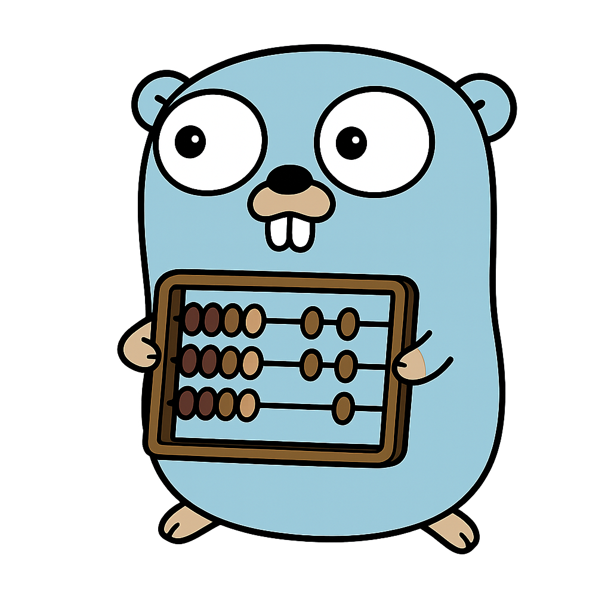

# Lines of Code Analyzer - Ogma
<p align="center">

</p>

A simple Golang-based utility that scans a project directory and reports the number of **files** and **lines of code** for various programming languages.  

It maps file extensions to languages, counts lines across files, and outputs results in a readable, color-formatted format.

---

## 🚀 Features

- Detects and counts lines of code for popular programming languages (Python, JavaScript, Go, Rust, Java, C, C++, TypeScript, etc.).
- Supports human-readable formatting of numbers (e.g., `1,234`).
- Uses [Aphrodite](https://github.com/jonathon-chew/Aphrodite) for colorized output.
- CLI integration via [cmd](https://github.com/jonathon-chew/Omga/cmd).

---

## 🛠️ Installation

Clone the repository:

```bash
git clone https://github.com/jonathon-chew/Ogma.git
cd Ogma

Build the binary:

go build -o Ogma

📦 Usage

Run the program in a project directory to analyze code:

./loc-analyzer

Optionally, you can pass CLI arguments that will be handled by the cmd

package:

./Ogma <args>

📊 Example Output

Name: Golang,        No. files: 12,        No. Lines: 1,542
Name: Python,        No. files: 5,         No. Lines: 873
Name: JavaScript,    No. files: 3,         No. Lines: 422

📚 Supported Languages

The tool supports a wide range of file extensions, mapped to their respective languages:
Extension	Language
.py	Python
.js	JavaScript
.java	Java
.go	Golang
.rs	Rust
.cpp	C++
.c, .cc, .cxx	C / C++
.cs	C#
.php	PHP
.rb	Ruby
.ts	TypeScript
.swift	Swift
.kt	Kotlin
.scala	Scala
.r	R
.dart	Dart
.hs	Haskell
.m	Objective-C
.qml	QML
.jl	Julia
.sh	Shell
.pl	Perl
.lua	Lua
.sql	SQL
.mod, .sum	Golang
.html	HTML
.css	CSS


📝 How It Works

    Walks the project directory recursively.

    For each file:

        Detects its extension.

        If recognized, opens the file and counts non-empty lines.

    Aggregates counts per language.

    Prints results in colorized output.

🧩 Dependencies

    Aphrodite

– for colorful console output.

cmd

    – for argument parsing.

Install them using:

go get github.com/jonathon-chew/Aphrodite
go get github.com/jonathon-chew/Ogma/cmd

### 🖌️ Attribution

The Go Gopher was originally designed by [Renee French](https://reneefrench.blogspot.com/).  
Used under the [Creative Commons Attribution 4.0 License](https://creativecommons.org/licenses/by/4.0/).  
